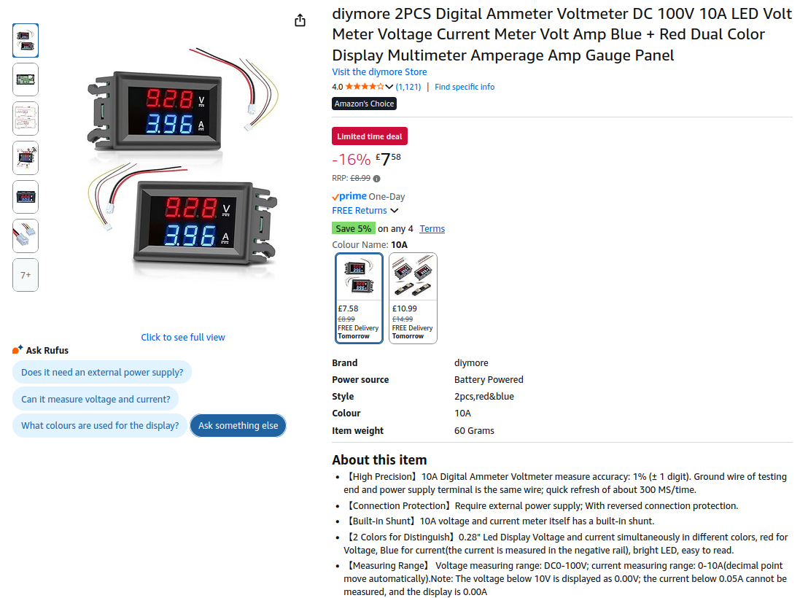
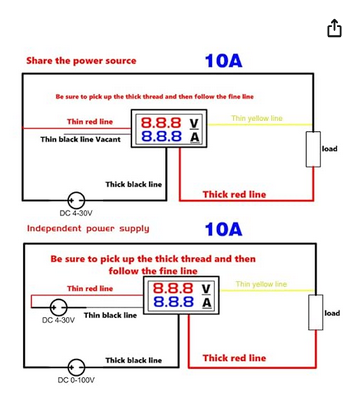
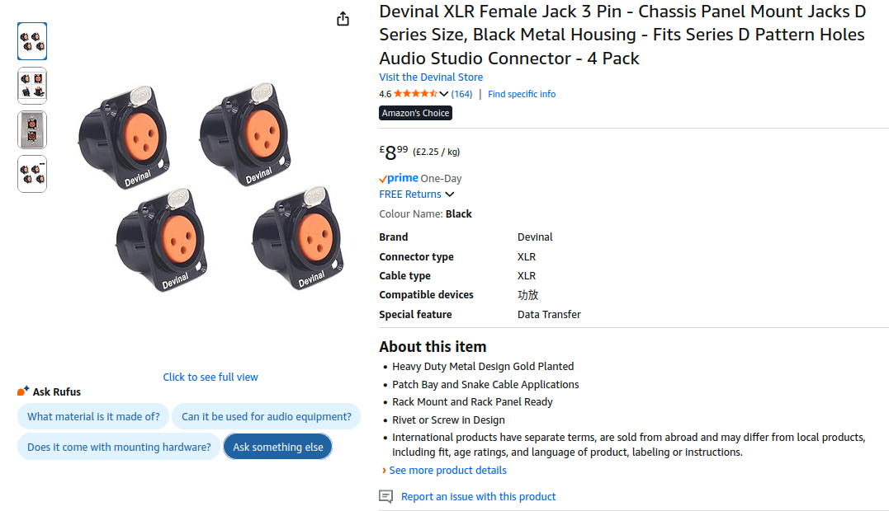
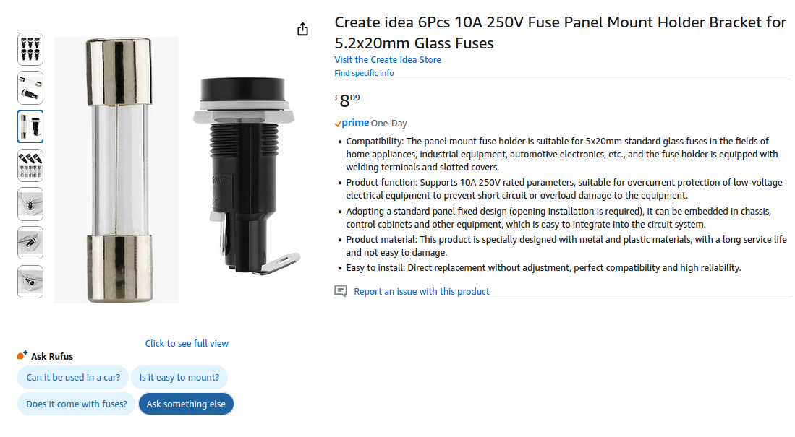
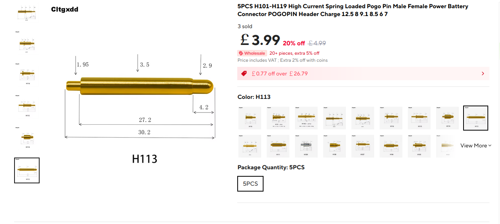
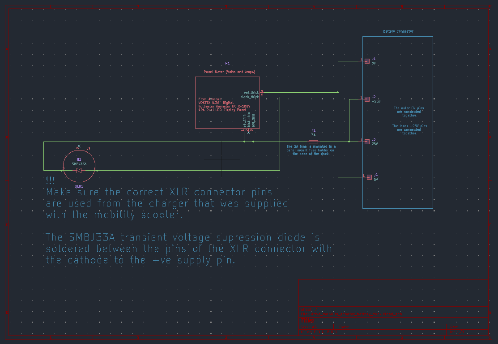

# Drive Mobility Scooter Dock.
I built this dock for a drive mobility scooter battery. The dock uses the battery charger supplied with the mobility scooter to charge the battery.

A panel meter in the dock is used to show the voltage and current when charging.

The mobility scooter model that this project was generated for, is the [AutoFold Elite](https://drivedevilbiss.co.uk/our-products/powered-mobility-wheelchairs/scooters/folding-scooters/autofold-elite).

# Hardware
I 3D printed the case parts detailed in the case folder. These were created using FreeCad V1.0. There are three required parts, the top, base and the pogo pin panel. I printed these using Bambulab PETG-CF filament on a Bambulab X1C printer.

## Parts Required.
The non 3D printed parts fitted to the 3d printed parts are shown below.

### Panel Meter
A link to the panel meter used can be found @ https://www.amazon.co.uk/dp/B085QDY11D/ref=twister_B09YV7KRQB?_encoding=UTF8&th=1

### XLR Connector
The XLR connector used can be found @ https://www.amazon.co.uk/dp/B07S6J8WVD?ref=ppx_yo2ov_dt_b_fed_asin_title

### Fuse Holder
The 20mm panel mount fuse holder can be found @ https://www.amazon.co.uk/Panel-Mount-Chassis-Holder-5x20mm/dp/B00XLSUOUO

### H113 Pogo pins from AliExpress
https://www.aliexpress.com/item/1005004524674158.html?spm=a2g0o.order_list.order_list_main.5.4b9118028GBk9F

## Assembly
The parts were connected as detailed in the following schematic.

!!!

It is important that the pogo pins are fitted to the base panel in the dock at the correct height. They should be fitted such that when compressed to 6mm (panel surface to top of pogo pin) there is about 1.5mm travel left on the pogo pin.

Four M3 brass thread inserts were added to the 3D printed base part to allow four M3 x 10mm countersunk screws to be fitted (two on each side). I used black nylon screws. These hold the top to the base.

## Battery
The battery that the dock charges had the following label for identification.

# License
This project is licensed under the Creative Commons Attribution 4.0 International License (CC BY 4.0).
See the LICENSE file for details.
